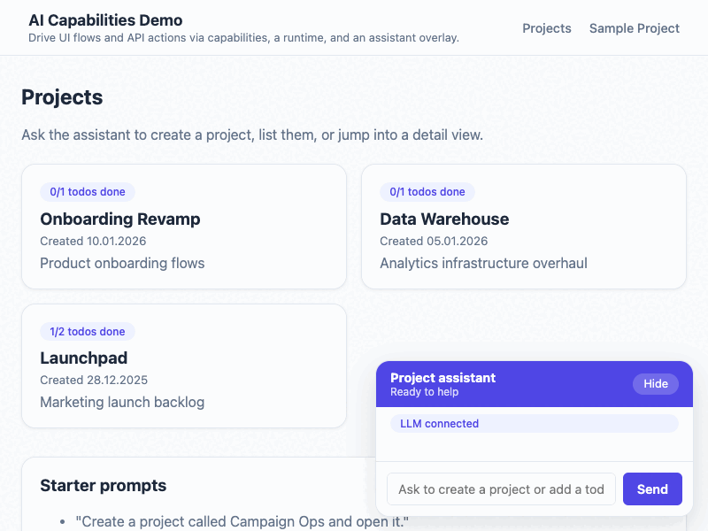

# React example: projects + todos with assistant overlay

This example turns a small React/Vite app into an “agent-ready” experience:

- JSON Server (`npm run dev:api`) provides `/projects` and `/todos` endpoints backed by `server/db.json`.
- A two-page UI (projects list + project detail) uses React Router v6 and shows real-time updates from the API.
- Capability handlers (`src/app-capabilities`) call the same HTTP endpoints, so agents can create projects, jump between pages, and manage todos.
- The floating chat overlay streams the capability manifest to your configured LLM endpoint (OpenAI, Ollama, internal, etc.) and executes whatever capability plan the model returns.



## Getting started

```bash
cd examples/react-app
cp .env.example .env                # customize API + LLM endpoints if needed
npm install
npm run dev:api                     # starts json-server on http://localhost:4001
npm run dev                         # starts Vite on http://localhost:5173
```

> Use `npm run dev:full` to launch both processes at once via `concurrently`.

Open `http://localhost:5173` and keep the API terminal visible—JSON Server prints every REST call triggered by the assistant, UI, or capability runtime.

## What to try

1. **Create a project** — "Create a project called Campaign Ops and open it."
2. **List projects** — "Show me all projects."
3. **Manage todos** — "Add a todo to Data Warehouse: review dashboards" or "Mark todo_2 as done."
4. **Navigate** — "Open project Launchpad" or "Go back to the projects list."

The assistant drives real capability executions underneath. You can also manipulate todos via the UI forms; everything stays in sync through the API.

## Capabilities exposed

| Capability ID | Purpose |
|---------------|---------|
| `projects.create` | POST `/projects` with generated IDs |
| `projects.list` / `projects.get` | GET `/projects` and `/projects/:id?_embed=todos` |
| `projects.todos.list` | GET `/todos?projectId=...` |
| `projects.todos.add` | POST `/todos` |
| `projects.todos.toggle` | PATCH `/todos/:id` |
| `navigation.open-project-page` | Pushes React Router to `/projects/:id` |
| `navigation.open-projects-list` | Navigates back to `/projects` |

`src/agent/runtime.ts` registers them all with `CapabilityRuntime` and injects adapters for router + toast logging.

## LLM configuration

The chat overlay sends a system prompt with the full capability manifest to your LLM and expects a plan in this format:

```json
{
  "actions": [{ "capabilityId": "projects.create", "input": { "name": "Analytics" } }],
  "reply": "Created project Analytics"
}
```

Settings come from `.env`:

```
VITE_API_BASE_URL=http://localhost:4001
VITE_AI_CAP_LLM_BASE_URL=https://api.openai.com/v1/chat/completions   # if no path given, the component appends /api/chat automatically
VITE_AI_CAP_LLM_MODEL=gpt-4o-mini
VITE_AI_CAP_LLM_API_KEY=sk-...                                        # optional, omit if the endpoint doesn't require a key
```

Make sure `VITE_AI_CAP_LLM_BASE_URL` points to the actual endpoint (including the path). If you pass only a host (e.g., `http://localhost:11434`), the component auto-appends `/api/chat` (Ollama convention). For OpenAI, use the full path `/v1/chat/completions`. If no key is needed, leave `VITE_AI_CAP_LLM_API_KEY` empty — the request will be sent without an `Authorization` header.

## Reusing this pattern

1. Run `npx ai-capabilities init` in your real project if you have not already.
2. Copy `src/app-capabilities/**` and replace the HTTP helpers with your production SDKs.
3. Reuse `src/components/AiChat.tsx` + `ChatOverlay.tsx` inside your existing layout; the component only needs React Router’s `useNavigate`.
4. Start exposing the canonical/public manifests via `npx ai-capabilities extract` and `npx ai-capabilities manifest public` so external agents can discover the same capabilities.

Need more context? See [docs/mixed-scenarios.md](../../docs/mixed-scenarios.md) for runtime topologies and [docs/quickstart.md](../../docs/quickstart.md) for the broader “discover → scaffold → author → test” flow.
